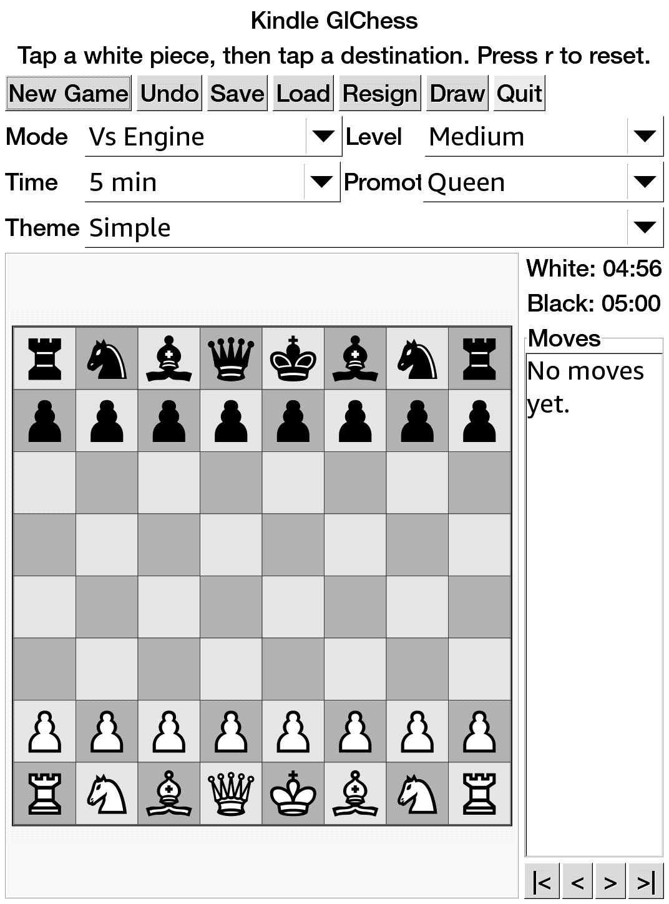

# Exact Chess

An e-ink-friendly chess app derived from GNOME Chess rules and assets.



Exact Chess is an unofficial e-ink-focused derivative application based in
part on GNOME Chess and GNOME Games. It keeps GNOME Chess-derived move rules
and artwork, while replacing the original GNOME desktop application shell with
a small GTK2/Cairo interface packaged for jailbroken KUAL-capable e-ink reader
devices.

This project also benefited from prior GNOME Games e-ink/KUAL porting and
packaging work by ThatPotatoDev and contributors. Original GNOME Chess code
and artwork remain credited to the GNOME Games authors.

## Features

- Touch-friendly GTK2 interface sized for e-ink screens.
- Cairo-rendered board with GNOME Chess simple/fancy SVG piece themes.
- GNOME Chess-derived legal move validation, check, checkmate, castling,
  en passant, promotion, SAN-style move history, undo, save, and load.
- Engine modes through an optional UCI engine, usually Stockfish: Play White,
  Play Black, and AI Demo.
- Two-player local mode with no engine moves.
- KUAL extension packaging with bundled ARM runtime libraries.

## Quick Install

Use the prebuilt extension package:

```text
release/exact-chess-extension.zip
```

Unzip it at the USB storage root so it creates:

```text
/mnt/us/extensions/exact-chess
/mnt/us/documents/shortcut_exact_chess.sh
```

Then launch from KUAL:

```text
KUAL -> Exact Chess -> Launch
```

The document shortcut is optional. KUAL is the reliable launch path; a stock
e-ink reader home screen normally will not execute `.sh` files unless another script
launcher/file association is installed.

## Prerequisites

This is native e-ink reader homebrew. You need:

- A jailbroken e-ink reader.
- KUAL installed.
- MRPI installed if your jailbreak/KUAL setup uses MRPI for package installs.
- USB access to copy this extension to `/mnt/us`.

e-ink reader jailbreak compatibility depends on model and firmware. Follow the
current guide for your exact device; do not assume a jailbreak method applies
just because another e-ink reader model works.

## Build

The supported build path is Docker cross/foreign-architecture build using an
ARMv7 Debian Bullseye container:

```bash
./docker_rebuild.sh
```

That command:

- Builds or starts the persistent `exact-chess-armhf-builder` container.
- Compiles the ARM hard-float `exact-chess` binary.
- Runs `smoke-test`.
- Packages `dist/exact-chess-extension.zip`.

If your Linux Docker install cannot run ARM containers, install binfmt support:

```bash
docker run --privileged --rm tonistiigi/binfmt --install arm
```

See [docs/BUILDING.md](docs/BUILDING.md) for the full build process.

## Release Artifact

The checked-in release artifact is:

```text
release/exact-chess-extension.zip
```

Verify it with:

```bash
cd release
sha256sum -c SHA256SUMS
```

## License And Provenance

Exact Chess is not an official GNOME project and is not affiliated with or
endorsed by GNOME, the GNOME Foundation, device manufacturers, or the prior
e-ink/KUAL porting projects it credits. It is a derivative project that
includes code and assets from GNOME Chess and GNOME Games, and keeps the
applicable GPL-family license texts in `licenses/`.

Runtime libraries bundled in the release zip keep their own upstream licenses;
the generated package includes `LICENSES/RUNTIME-LIBS.txt` and
`LICENSES/THIRD-PARTY-NOTICE.txt`.

See [docs/PROVENANCE.md](docs/PROVENANCE.md).
